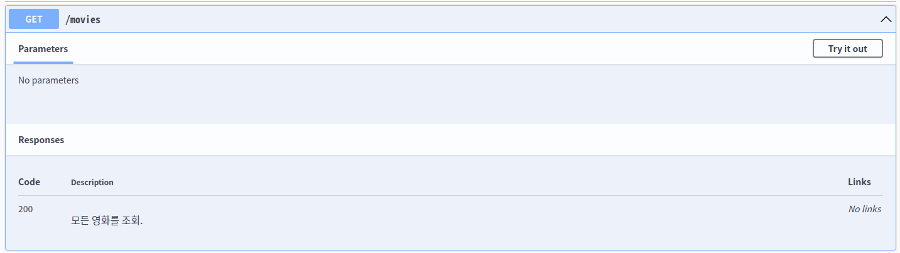
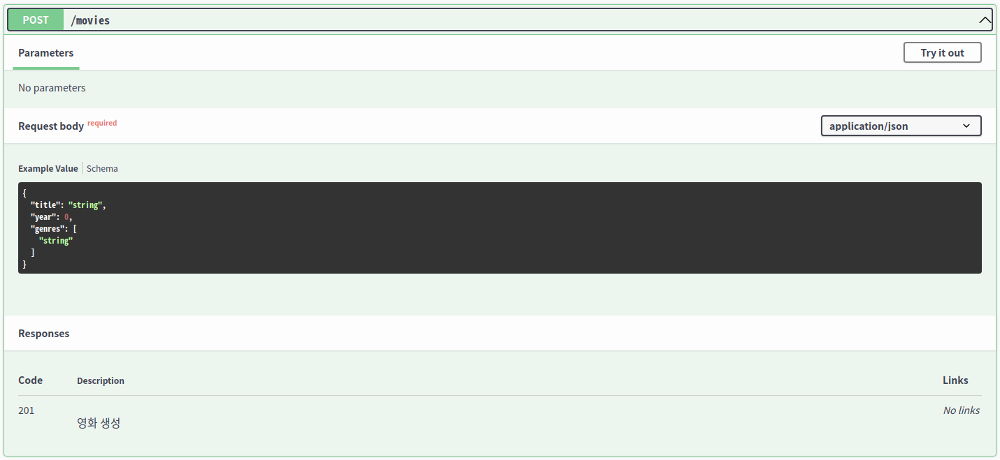
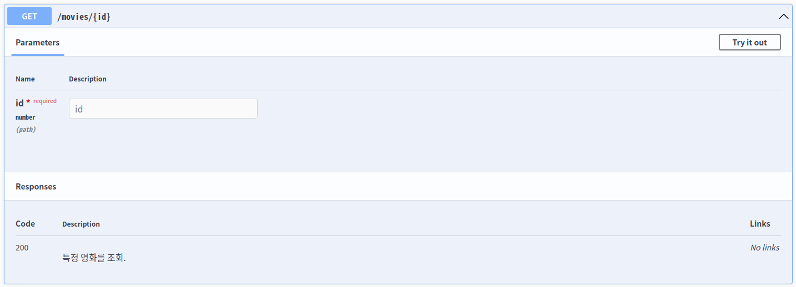
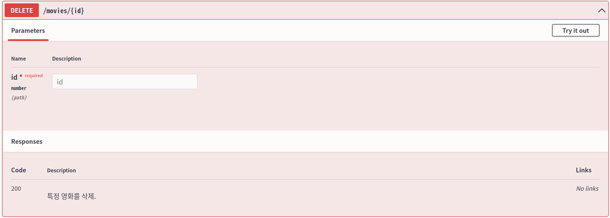
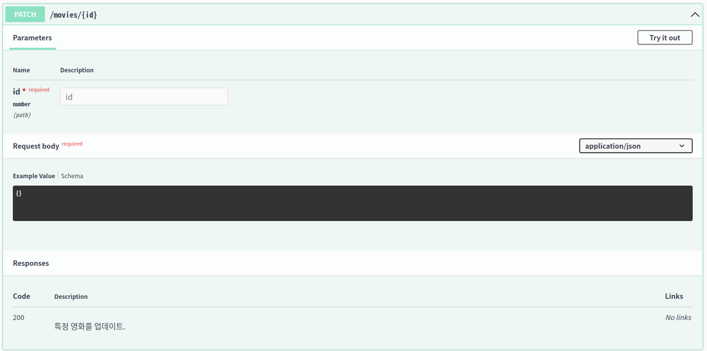

# Movie API CRUD 


## Description

노마드 코더 NestJS 강의를 들으며 Movie CRUD와 Test code 작성을 공부.

### 모든 영화 조회

### 영화 생성

### 특정 영화 찾기

### 특정 영화 삭제

### 특정 영화 업데이트


## Swagger
http://localhost:3000/api

## 개발 환경
```bash
OS: Ubuntu18.04
IDE: VSCODE
NEST: v8.1.2
NODEJS: v12.22.6
NPM: v6.14.15
```
## Installation

```bash
$ npm install
```

## Running the app

```bash
# development
$ npm run start

# watch mode
$ npm run start:dev

# production mode
$ npm run start:prod

# port
3000
```


## Test

```bash
# unit tests
$ npm run test

# e2e tests
$ npm run test:e2e

# test coverage
$ npm run test:cov
```
